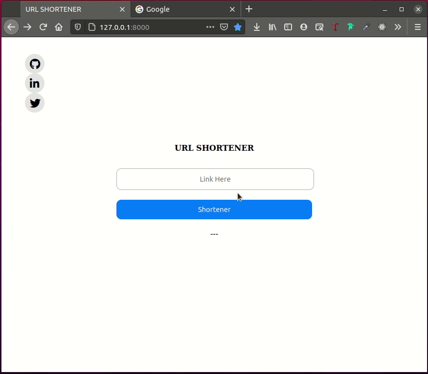

# URL Shortener
O encurtador de url permite reduzir o tamanho de um url. Tornando o url curto e limpo.

## Pré-requisitos

- <a href="https://git-scm.com/">Git</a>
- <a href="https://www.python.org/downloads/">Python</a>
- Python interpreter 
    - <a href="https://www.jetbrains.com/pycharm/download/">PyCharm</a>
    - <a href="https://code.visualstudio.com/">VS Code</a>
- <a href="https://www.djangoproject.com/">Django</a>


## Clone o repositório
Clone o repositorio `https://github.com/mariomthree/url-shortener` para a sua maquina.

## Configurações de variáveis dos ambiente
Esta configuração é necessária para poder instalar as dependências do projeto.

Linux e macOS:
```sh
    $ python3 -m pip install --user virtualenv
    $ virtualenv -p python3 .
    $ source bin/activate
    $ which python
    $ pip3 install django
```

Windows:
```sh
    $ py -m pip install --user virtualenv
    $ py -m venv env
    $ .\env\Scripts\activate
    $ where python
    $ pip install django
```

## Iniciar o projecto

Abra o projecto com o terminal da sua maquina e siga os passos abaixo:

```sh
    $ cd src/
    $ python manage.py migrate
    $ python manage.py runserver
```
De seguida abra o seu navegador e digite http://127.0.0.1:8000/

## Demo


## Licença
O url-shortener é um software de código aberto licenciado sob a <a href="https://opensource.org/licenses/MIT">licença MIT</a>